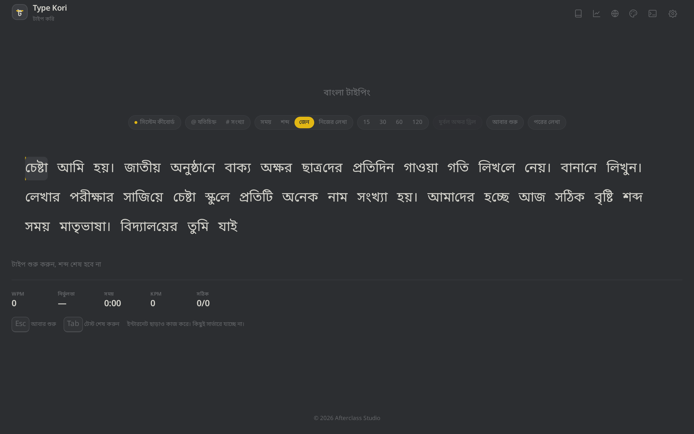
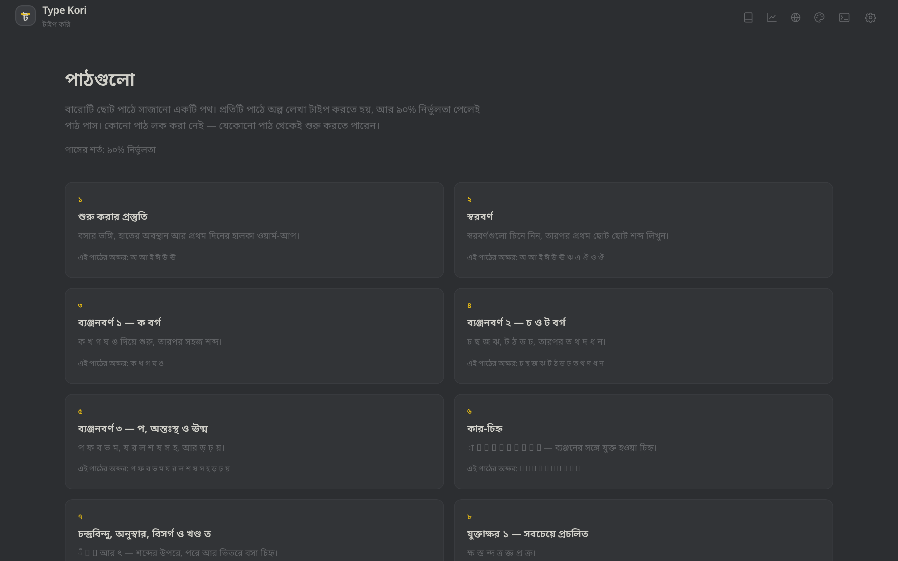

<div align="center">

# টাইপ করি · Type Kori

### The Bangla typing trainer.

Learn and practice typing Bangla on a PC keyboard — structured lessons, endless
speed tests and honest progress tracking, **free, no sign-up, no ads**, and no
data leaves your device.

*structured lessons · endless stream · 12 lessons · 261 themes · 21 badges ·
custom text · weak-key drills — instantly, in the browser, in English or বাংলা*

[](https://github.com/auntor69/type-kori/actions/workflows/ci.yml)
[](LICENSE)
[](package.json)
[](https://typekori.vercel.app)

**[Live app](https://typekori.vercel.app)** · [Report a bug](https://github.com/auntor69/type-kori/issues/new?template=bug_report.yml) · [Feature idea](https://github.com/auntor69/type-kori/issues/new?template=feature_request.yml) · [Security policy](SECURITY.md) · [Contributing](CONTRIBUTING.md)



</div>

---

## What it is

A static website. The content pages are prerendered HTML; the typing area is a
small interactive island. There is no backend, no database, no account, and no
third-party tracker. Progress lives in `localStorage`.

Two input modes:

- **System keyboard mode** — you already have a Bangla keyboard (Avro Keyboard,
  an OS layout, …). The app compares the Unicode your keyboard produces against
  the target text. Any layout works, and the app scores what you actually typed.
- **Built-in mode (preview)** — the app converts Roman keystrokes into Bangla
  itself, so nothing needs to be installed. Native speakers have not signed off the
  rules yet, so it stays an opt-in preview and the system keyboard remains the
  default.

A word counts as correct when its final Unicode text matches the target after
normalization, no matter which keystrokes produced it.

Finished runs, the error map, lesson results and the settings all live in
`localStorage`. The progress page summarises them and can export, import or reset
them as one JSON file.

## Features

| | |
|---|---|
| **Endless stream** | Untimed runs never run out — a fresh line of words is generated whenever the caret gets near the end, keeping up with 100+ WPM typists without a single visual jump. |
| **Time / words / zen** | 15/30/60/120-second runs, 10/25/50/100-word goals that end exactly at the goal, or the endless zen stream (`Tab` ends it). |
| **12 lessons** | A path from the vowels to conjuncts, numbers and real-world text — fixed drills, untimed, passed at 90% accuracy. |
| **Your own text** | Paste an exam question or book paragraph (Bangla only, 12–1200 characters) and practise exactly that — stored on your device, never uploaded. |
| **Funboxes** | Twist the stream: Bengali numerals, punctuation, reversed words, or a memory mode that hides the words ahead. |
| **261 themes** | Built-ins, community classics, and one palette for every country flag — every one contrast checked. Star them, export them. |
| **Command bar** | `Ctrl+K` palette and `Ctrl+/` command line share one grammar: `theme dracula · time 60 · words 25 · funbox numbers · goto progress`. |
| **Honest progress** | Personal bests per test type, streaks, 21 badges, a miss-rate heat grid and the speed trend. |
| **Weak-key drills** | One focused drill over the clusters you mistype most. |
| **Offline PWA** | Install it and it works with no network at all. Nothing is fetched from a third-party server at runtime. |

## Lessons

`/lessons` is a path of twelve short lessons, from the vowels to conjuncts, numbers
and real-world text. Each lesson is a fixed drill set with no timer, passed at 90%
accuracy. The curriculum and its copy are in `src/content/lessons.ts`, the drill
texts in `content/lessons/drills.json`, and every drill carries the same
`reviewed` flag as a practice text.

<p align="center">
  
</p>

## Your own text

On the practice page, **Your own text** opens a paste box: paste an exam question
or a paragraph from a book and, once it passes the checks (Bangla only, 12–1200
characters in 3–200 words), it becomes the target of one untimed run. The text is
kept in `localStorage` (never uploaded), it travels with the export/import file,
and "reset all data" on the progress page removes it too.

## Beyond the basics

The practice test streams words endlessly, like monkeytype: untimed runs on the
built-in library never run out, because the island appends a fresh line whenever
the caret gets near the end. `Tab` ends the run and shows the results.

`Ctrl+K` (or the terminal icon in the header) opens the **command palette**, and
`Ctrl+/` opens the **command line** — the same grammar either way:

```
theme dracula      time 60        words 25       funbox numbers
conf max           typos below    blind on       goto progress
```

`time` counts bare numbers in **seconds** (`time 90` is a minute and a half);
an explicit suffix says otherwise (`time 5m`, `time 45s`). `words` counts words,
and a bare `words` or `time` alone starts an endless run.

The toolbar above the words is monkeytype's config bar: **@ punctuation** and
**# numbers** toggles, a **time / words / zen / custom** mode row, and duration
chips — 15/30/60/120 seconds in time mode, 10/25/50/100 words in words mode.
`zen` is the endless stream, `custom` opens **Your own text**.

Settings go deep: difficulty, quick restart key, confidence mode, minimum speed
and accuracy, indicate typos, hide extra letters, words history, focus mode,
sound volume, and further funbox modes that twist the stream (Bengali numerals,
punctuation, reversed words, or words you have to remember). A difficulty or
funbox change restarts the run on screen, so the choice takes effect right away
— a pasted text, a lesson drill and a weak-key drill are exempt, since they are
fixed targets. A small palette icon in the header opens the theme picker.

The theme gallery ships 261 palettes: the built-in ones, community classics, and
one for every country flag (search "Bangladesh", or filter by *flags*). A flag
theme is built out of that flag's own colours — the page keeps the field colour,
the accent is the flag's most vivid colour (Argentina's sun, Vietnam's star), the
text is the flag's white or its darkest ink — and every palette is contrast
checked, so none of them can be unreadable. Themes can be starred and exported as
JSON.

The progress page keeps personal bests per test type, streaks, 21 badges, a
miss-rate heat grid and the speed trend.

## Requirements

- [Bun](https://bun.sh) ≥ 1.4 for development and scripts.
- Node ≥ 22 for the `scripts/` helpers that run outside Bun.

## Stack

Astro (static output) + TypeScript, Preact for the interactive islands, Tailwind
CSS v4 with the CSS-variable tokens in `src/styles/tokens.css`, Vitest for unit
tests. Content pages are prerendered HTML; only the typing area and the settings
drawer ship JavaScript. There is no backend.

Nothing is fetched from a third-party server at runtime: the fonts are
self-hosted and there is no analytics or advertising script. Astro's build-time
telemetry is disabled in CI with `ASTRO_TELEMETRY_DISABLED=1`, and can be disabled
locally the same way (or with `bunx astro telemetry disable`).

## Run it

```sh
bun install
bun run dev
```

The dev server binds to `0.0.0.0` and reads `PORT` from the environment
(falling back to `4321`), so the hosted preview keeps working.

Other scripts:

| Command | What it does |
|---|---|
| `bun run dev` | Dev server |
| `bun run build` | Production build to `dist/` |
| `bun run preview` | Serve the built output |
| `bun run typecheck` | `tsc -b --noEmit` |
| `bun run test` | Unit tests (Vitest) |
| `bun run test:scripts` | Unit tests for the `scripts/` helpers |
| `bun run check:attribution` | Authorship guard: tracked files + commit messages |
| `bun run validate:text` | Content validator: characters, encodings, review flags |

Pages: `/` (practice), `/lessons` (the twelve-lesson path, one page per lesson),
`/progress` (history and data), `/privacy`. Every page has an English mirror under
`/en/`.

## Test

```sh
bun run test           # engine, metrics, storage
bun run test:scripts   # the attribution guard
bun run typecheck
```

Pure logic (the typing engine, metrics, cluster splitting, storage) is unit
tested. Tests are written together with the code, not afterwards.

## Git hook

The repository enforces authorship rules locally. Enable the hook once per clone:

```sh
git config core.hooksPath .githooks
```

`.githooks/commit-msg` rejects a commit message that contains attribution
patterns, and CI runs the same check (`scripts/check-attribution.mjs`) over the
changed range and over every tracked file. `docs/MASTERPLAN.md` and the guard
script itself are the only files excluded from the file scan.

## Project documents

- `docs/MASTERPLAN.md` — the plan. Read this before changing anything.
- `docs/PROGRESS.md` — the roadmap checklist, ticked phase by phase.
- `docs/DECISIONS.md` — every deviation from the plan and every non-obvious choice.
- `docs/VERIFY.md` — open questions that need a native Bangla speaker.

## Contributing

Contributions of reviewed practice texts, translations and test cases for the
typing engine are welcome. Every text needs a native-speaker review before it
ships, and every rule of pure logic needs a test. Start with
[CONTRIBUTING.md](CONTRIBUTING.md) — it walks through the setup, the gates and
the house rules. Bug reports and feature ideas go through the issue templates.

By participating you agree to the
[Code of Conduct](CODE_OF_CONDUCT.md). Security issues go through
[SECURITY.md](SECURITY.md)'s private channel, never a public issue.

## The phonetic grammar

`src/engine/input/phonetic-rules.json` is this project's own grammar for the
well-known Avro phonetic conventions. It is **not** copied from an existing
implementation: the reference implementations are GPL-3.0, MPL, or state no
licence at all, so none of them can be relicensed under MIT. Every row records
where it came from in the file's own `meta.sources`, and a row is only marked
`nativeReviewed: true` once a human has checked it against a real keyboard.
Built-in mode therefore ships as an opt-in preview, not the default. The full
licence analysis is in `docs/DECISIONS.md`.

## License

- Code: MIT — see `LICENSE`.
- Lesson and practice text: original content of this project, released under CC0
  (`content/`), unless a file states otherwise.
- The phonetic grammar: original to this project, MIT, like the rest of the code.

---

<div align="center">

Built with care by **Afterclass Studio** — © 2026 Afterclass Studio

</div>
